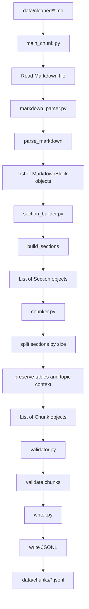
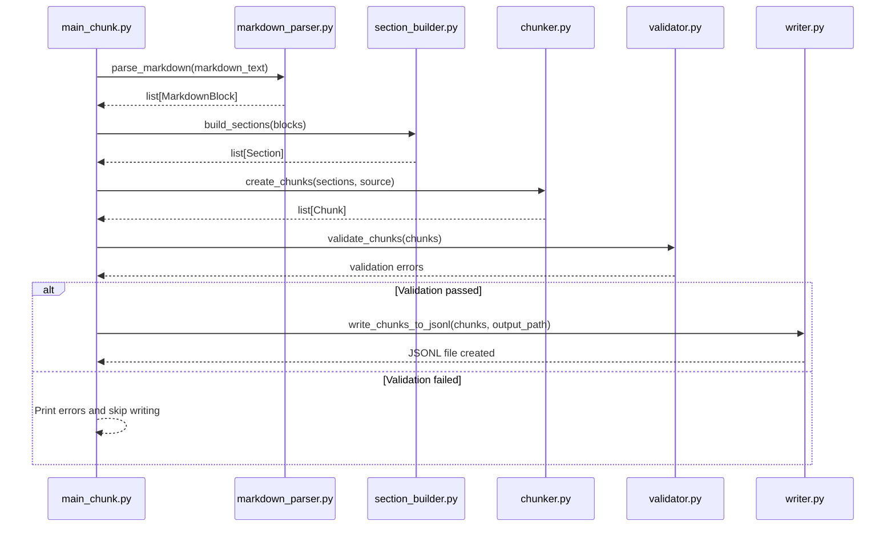

# Chunking Workflow

## Purpose

The chunking module converts cleaned Markdown documents into structured JSONL chunks for embedding generation and vector database indexing.

The workflow preserves:

* Markdown headings
* Educational topic boundaries
* Tables
* Source positions
* Metadata
* Connections with images

The main goal is to create small, meaningful learning units that can later be used for explanations, diagrams, quizzes, and ADHD-friendly learning.

---

## Workflow Overview



---

## File Responsibilities

### `models.py`

Contains the data models used by the chunking pipeline.

#### `MarkdownBlock`

Represents one structural element extracted from Markdown.

Possible block types:

* `heading`
* `text`
* `table`

Example:

```python
MarkdownBlock(
    block_type="text",
    text="The railway risk must be identified.",
    heading_path=["AMV", "Railway risks"],
    start_char=120,
    end_char=158,
)
```

#### `Section`

Represents one educational topic.

A section contains text and table blocks that belong to the same heading path.

Example:

```python
Section(
    section_id="section_001",
    heading_path=["AMV", "Railway risks"],
    blocks=[text_block, table_block],
    start_char=120,
    end_char=420,
)
```

#### `ChunkMetadata`

Stores information about the source and structure of a final chunk.

Main fields:

* `source`
* `chunk_number`
* `heading`
* `heading_path`
* `chunk_type`
* `section_id`
* `start_char`
* `end_char`
* `images`

#### `Chunk`

Represents the final text fragment prepared for indexing.

The `to_dict()` method converts the object into a JSON-compatible dictionary.

---

### `markdown_parser.py`

Converts raw Markdown text into structural blocks.

Main function:

```python
parse_markdown(markdown_text: str) -> list[MarkdownBlock]
```

Internal workflow:

```text
Markdown text
    ↓
Split into lines
    ↓
Detect headings
    ↓
Detect tables
    ↓
Collect ordinary text
    ↓
Create MarkdownBlock objects
```

Supporting functions:

```python
parse_heading()
```

Detects Markdown headings and returns their level and text.

```python
is_table_separator()
```

Detects a Markdown table separator.

Example:

```markdown
|---|---|
```

```python
is_table_row()
```

Checks whether a line can be part of a Markdown table.

```python
is_table_start()
```

Checks whether two consecutive lines start a Markdown table.

```python
_split_lines_with_positions()
```

Splits the document into lines and preserves character positions.

```python
_get_heading_path()
```

Returns heading texts without heading levels.

```python
_create_text_block()
```

Creates one text block from accumulated text lines.

Output:

```python
list[MarkdownBlock]
```

---

### `section_builder.py`

Groups Markdown blocks into educational sections.

Main function:

```python
build_sections(
    blocks: list[MarkdownBlock],
) -> list[Section]
```

Workflow:

```text
MarkdownBlock list
    ↓
Ignore separate heading blocks
    ↓
Compare heading paths
    ↓
Group text and tables with the same heading path
    ↓
Create Section objects
```

A new section starts when the heading path changes.

Example:

```text
Heading path:
AMV → Railway risks

Blocks:
- text
- table
- text
```

These blocks become one `Section`.

Output:

```python
list[Section]
```

---

### `chunker.py`

Converts sections into final chunks.

Planned main function:

```python
create_chunks(
    sections: list[Section],
    source: str,
) -> list[Chunk]
```

Workflow:

```text
Section
    ↓
Build section text
    ↓
Check section size
    ↓
Small section → one chunk
Large section → several chunks
    ↓
Preserve heading context
    ↓
Preserve complete table rows
    ↓
Create Chunk objects
```

Main rules:

* One chunk should contain one educational topic.
* Small sections should remain intact.
* Large sections should be split by paragraphs.
* Very large paragraphs may be split by sentences.
* Tables must not be split in the middle of a row.
* A table header must be repeated when a large table is divided.
* Heading context must be included in every related chunk.
* Overlap should be added only when a section is split.

Output:

```python
list[Chunk]
```

---

### `validator.py`

Validates generated chunks before saving.

Planned main function:

```python
validate_chunks(chunks: list[Chunk]) -> list[str]
```

Checks:

* Empty chunk text
* Missing source
* Missing heading
* Duplicate chunk IDs
* Incorrect chunk numbering
* Oversized chunks
* Invalid character positions
* Broken table structure

The validator returns a list of detected errors.

An empty list means that validation passed.

---

### `writer.py`

Writes final chunks to JSONL files.

Planned main function:

```python
write_chunks_to_jsonl(
    chunks: list[Chunk],
    output_path: Path,
) -> None
```

Each line in the output file contains one JSON object.

Example:

```json
{
  "id": "amv_001_005_chunk_0001",
  "text": "## Railway risks\n\nThe railway risk must be identified.",
  "metadata": {
    "source": "amv_001_005.md",
    "chunk_number": 1,
    "heading": "Railway risks",
    "heading_path": [
      "AMV",
      "Railway risks"
    ],
    "chunk_type": "text",
    "section_id": "section_001",
    "start_char": 120,
    "end_char": 158,
    "images": [],
    "size_chars": 61
  }
}
```

Output:

```text
data/chunks/<source_name>.jsonl
```

---

### `main_chunk.py`

The root execution file for Phase 4.

It coordinates the complete workflow but does not contain chunking logic.

Execution flow:

```python
read Markdown files
    ↓
parse_markdown()
    ↓
build_sections()
    ↓
create_chunks()
    ↓
validate_chunks()
    ↓
write_chunks_to_jsonl()
```

Input:

```text
data/cleaned/*.md
```

Output:

```text
data/chunks/*.jsonl
```

---

## Function Call Sequence



---

## Data Transformation

```text
Markdown file
    ↓
str
    ↓
list[MarkdownBlock]
    ↓
list[Section]
    ↓
list[Chunk]
    ↓
JSONL file
```

---

## Current Implementation Status

| Component            | Status      |
| -------------------- | ----------- |
| `models.py`          | Implemented |
| `markdown_parser.py` | Implemented |
| `section_builder.py` | In progress |
| `chunker.py`         | Planned     |
| `validator.py`       | Planned     |
| `writer.py`          | Planned     |
| `main_chunk.py`      | Planned     |

---

## Design Principles

1. Preserve the original source text.
2. Keep one educational topic per section.
3. Avoid mechanical splitting when the structure provides a natural boundary.
4. Preserve Markdown tables.
5. Keep metadata sufficient for later retrieval and debugging.
6. Keep chunking independent from the embedding model.
7. Keep business logic inside `src/chunking`.
8. Keep the root execution file limited to workflow coordination.
9. Make the output reproducible and testable.
10. Prepare the data for student-oriented explanations, quizzes, and visual learning.
